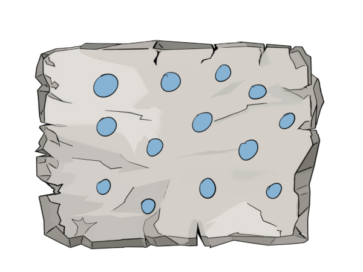
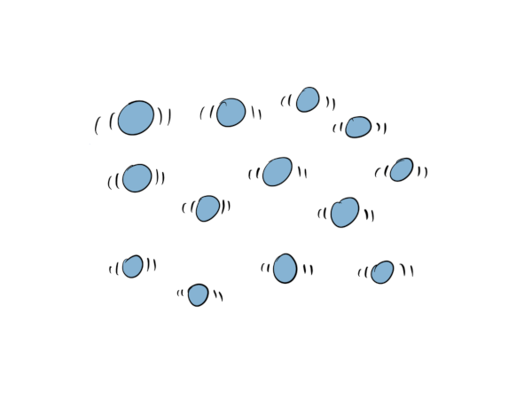
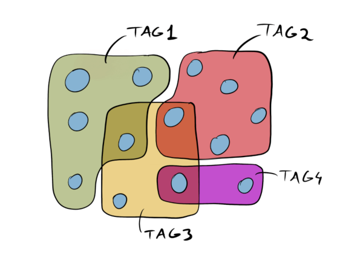
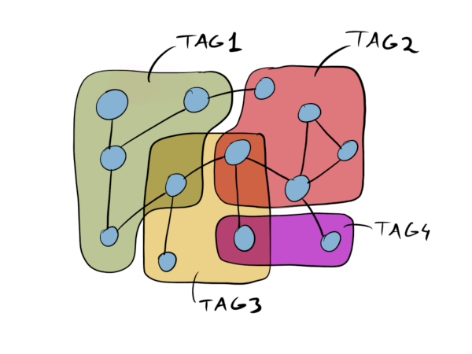
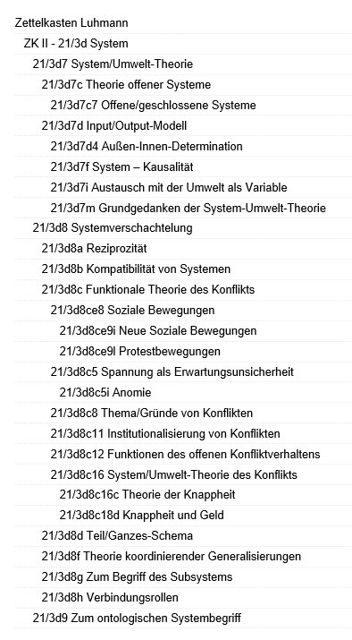
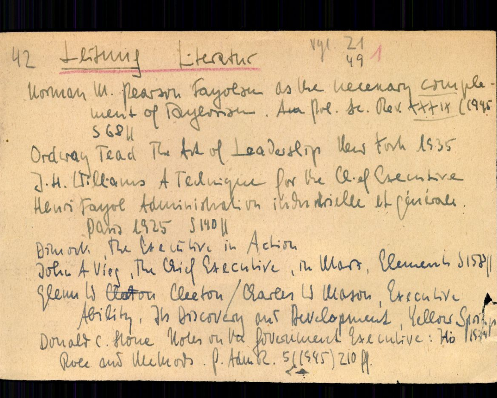
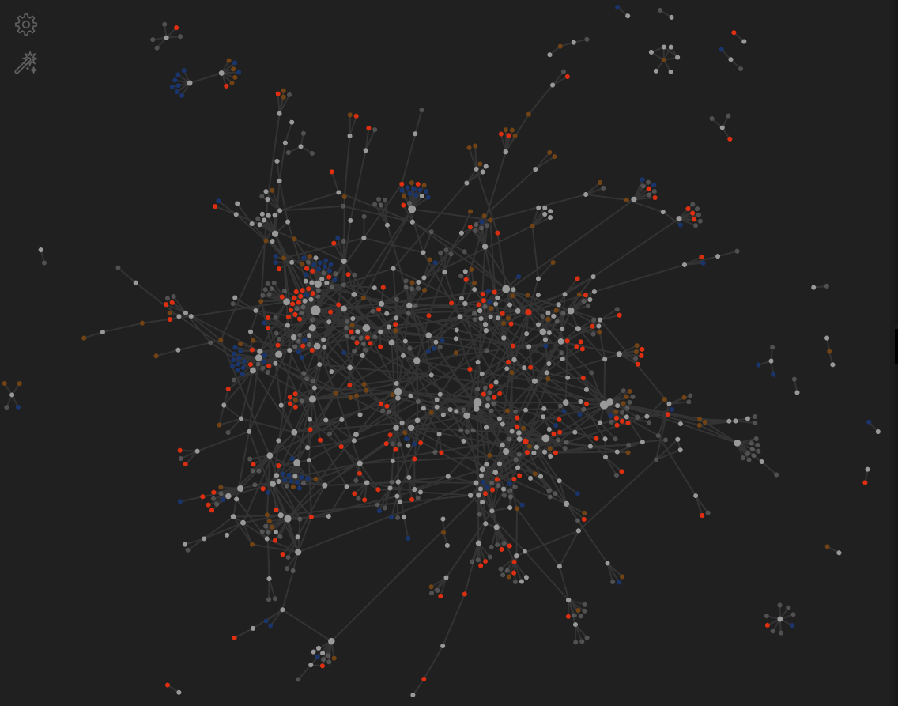

## principes de la méthode Zettelkasten
### présentation d'Obsidian
#### Damien Belvèze
#### 21 février 2021

---

- **méthode de classement de notes** destinée à accroître la productivité et l'inventivité

- [Niklas Luhmann](https://en.wikipedia.org/wiki/Niklas_Luhmann)(1927-1998) chercheur en sociologie à Bielefeld

- Zettelkasten : petites cases

---
## Quel est l'apport véritable de la méthode ?

Luhmann est-il devenu un génie parce qu'il a inventé un système de notes complexe ou bien a t-il inventé un système de notes complexe parce qu'il est un génie ? (Bjarnason Baldur)

---

        
Notes prises dans la matrice (exemple : un cahier imprimé) 

---

notes volantes, pas de liens (exemple : des post-its)

---

notes rangées par catégories / dossiers 

---

- Pas de rangement d'une note dans deux catégories 

- Comment ranger facilement une note dans une catégorie plus récente et plus pertinente ? <!-- element class="fragment" data-fragment-index="1" -->

---

notes rangées par tags 

---

- difficulté de gérer un grand nombre de tags

- risque d'utiliser deux tags différents pour deux notes ayant le même sujet

---

 
notes rangées liées par des liens et des rétroliens

---

- pas de catégorie = plus de souplesse, pas de structure interne

- chaque note est identifiable par un identifiant unique

- dans la version électronique, pas de besoin de ranger les notes par ordre de création

---

 

arborescence ou horizontalité ?

---

--- 

## Le rôle de l'identifiant pérenne

- nécessaire dans un index imprimé, il devient facultatif dans le monde numérique
- les logiciels permettent de renommer des notes sans que les liens vers ces notes soient rompus
- Ces identifiants sont pourtant, selon Arthur Perret, le gage d'une véritable pérennité de nos notes
	
---

---
